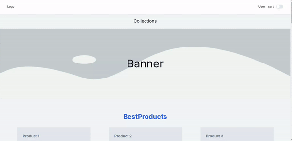

# [e-commerce-mvp Frontend](https://github.com/RyuzakiiL23/e-commerce-mvp)

### 🚀 Welcome to our e-commerce-mvp Frontend! 💻

### Overview 📝

✨ Our frontend is built with Next.js to provide a seamless and dynamic user experience.

### Features ✨

⚡️ Our frontend comes with the following features:

- Modern and responsive homepage design.
- Placeholder elements for upcoming features.
- Easy navigation and user-friendly interface.

### Dependencies 📦

🔧 The frontend has the following dependencies:

- `Next.js`: Framework for server-rendered or statically-exported React applications.
- `React`: JavaScript library for building user interfaces.
- `Node.js` and `npm`: Required to run and manage the project dependencies.

⚙️ Here is a glimpse of our [Home page](https://github.com/SaadBarhrouj/e-commerce-mvp/tree/Frontend) :



## How to Try It Locally 🚀

📋 To get started, follow these steps:

1. Clone the repository and navigate to the project directory.

```
https://github.com/SaadBarhrouj/e-commerce-mvp.git
cd e-commerce-mvp.git
```
2. Install the dependencies.

```
npm install
```
3. Run the development server.

```
npm run dev
```
4. Open your browser and go to http://localhost:3000 to see the homepage.

```
http://localhost:3000
```
